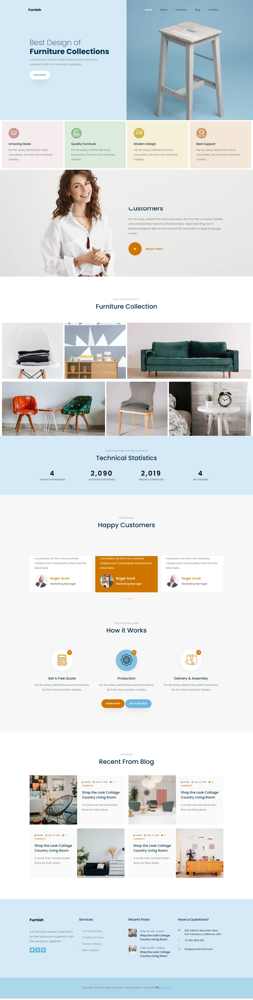

# 🛋️ Furnish — Furniture Brand Website

A responsive, multi-page static website for a modern furniture brand — built with pure **HTML5** and **CSS3**. Furnish showcases a full landing page experience with smooth load animations, a furniture gallery grid, testimonials, a production flow section, a blog, and a dedicated contact page.

---

## 📋 Table of Contents

- [Overview](#overview)
- [Pages](#pages)
- [Sections](#sections)
- [Design System](#design-system)
- [Animations](#animations)
- [Responsive Breakpoints](#responsive-breakpoints)
- [Project Structure](#project-structure)
- [Getting Started](#getting-started)
- [Screenshots](#screenshots)

---

## Overview

Furnish is a front-end only website built without any frameworks or JavaScript libraries. It uses a custom CSS design system with CSS variables for consistent typography, colours, and spacing across both pages. The layout is built entirely with **Flexbox** and **CSS Grid**.

**Tech Stack:** HTML5 · CSS3 · Google Fonts (Poppins)

---

## Pages

| File | Description |
|---|---|
| `main.html` | Main landing page with all brand sections |
| `contact.html` | Dedicated contact page with form and social links |

---

## Sections

The `main.html` page is structured into the following sections from top to bottom:

**Navbar** — Top navigation with logo and links: Home, About, Collection, Blog, and Contact (links to `contact.html`).

**Hero / Landing** — Full-viewport split layout with animated headline text on the left and a full-bleed cover photo on the right. Features a staggered `fadeInUp` entrance animation on the heading, subheading, and CTA button.

**Features Strip** — Four colour-coded feature cards with SVG flaticons highlighting: Amazing Deals, Quality Furniture, Modern Design, and Best Support.

**About / Quality** — Full-bleed background image section with an overlay text panel covering the brand's quality message, with an orange play button for a video CTA.

**Furniture Gallery** — A 6-item CSS Grid gallery using a 20-column layout with varying widths (25%, 25%, 50%, 40%, 35%, 25%) for an editorial mosaic effect. Each tile has a hover overlay revealing the item name.

**Statistics** — Blue-tinted section with 4 key metrics: 20 Years of Experience · 10,200 Satisfied Customers · 9,850 Projects Completed · 20 Awards.

**Testimonials** — 3-column customer review grid on a warm background. The centre card uses an orange accent variant. Each card features a circular avatar and reviewer details.

**How It Works** — 3-step production flow (Get a Free Quote → Production → Delivery & Assemble) with numbered circular icons and dual CTA buttons.

**Blog** — 4 blog post cards in a 2×2 grid, each with a thumbnail image, metadata (author, date, comments), and a title.

**Footer** — 4-column footer with brand description, services list, recent posts with thumbnails, and contact info. Ends with a copyright bar.

---

### Contact Page Sections

**Contact Info** — Address, Email, and Phone in a clean card row.

**Contact Form** — Inputs for Name, Email, Subject, and a message textarea with a Send Message CTA.

**Social Links** — Facebook, Twitter, Instagram, and Dribbble.

---

## Design System

Defined in `Styles/common.css` using CSS custom properties:

### Typography

| Class | Usage | Font Size |
|---|---|---|
| `.fn-landing-heading` | Hero headline | 45px |
| `.fn-section-heading` | Section titles | 38px |
| `.fn-section-tagline` | Eyebrow labels (uppercase) | 13px |
| `.fn-div-heading` | Card / step titles | 18px |
| `.cards-heading` | Card headings | 18px |
| `.cards-subtitle` | Body / description text | 16px |

**Font:** `Poppins` (Google Fonts) — weights 100–900

### Colour Palette

| Variable | Value | Usage |
|---|---|---|
| `--heading-dark` | `rgb(5, 44, 67)` | Primary headings |
| `--blue` | `rgb(38, 122, 164)` | Accent / links |
| `--blue-light` | `rgb(212, 234, 245)` | Feature strip & footer bg |
| `--blue-semi-dark` | `rgb(171, 214, 235)` | Footer copyright bar |
| `--blue-links` | `rgb(109, 183, 221)` | Button & icon accent |
| `--orange` | `rgb(207, 117, 0)` | CTA buttons & highlights |
| `--light-orange` | `rgb(247, 247, 247)` | Testimonials & How it Works bg |
| `--tagline-color` | `rgba(0, 0, 0, 0.4)` | Muted tagline text |

### Feature Card Colours

Each feature card has its own light background and darker icon circle:

| Feature | Background | Icon Circle |
|---|---|---|
| Amazing Deals | `--f1-light` (rose tint) | `--f1-dark` |
| Quality Furniture | `--f2-light` (green tint) | `--f2-dark` |
| Modern Design | `--f3-light` (yellow tint) | `--f3-dark` |
| Best Support | `--f4-light` (orange tint) | `--f4-dark` |

---

## Animations

Defined in `common.css` using pure CSS `@keyframes`:

```css
@keyframes fadeInUp {
  from { opacity: 0; transform: translateY(30px); }
  to   { opacity: 1; transform: translateY(0); }
}
```

Elements with `.animate-on-load` trigger this on page load. Staggered delays are applied via utility classes:

| Class | Delay |
|---|---|
| `.delay-1` | 0.2s |
| `.delay-2` | 0.4s |
| `.delay-3` | 0.6s |

The navbar and hero section (heading → subheading → CTA button) use this staggered sequence for a polished entrance effect.

---

## Responsive Breakpoints

| Breakpoint | Layout Changes |
|---|---|
| `≤ 1045px` | Blog margins reduced; About text panel width adjusted |
| `≤ 992px` | Stats go 2-column; How It Works goes 2-column; Testimonials go 2-column; Blog margins tighten |
| `≤ 576px` | All grids go single-column; Blog cards stack vertically; Footer columns stack; Blog images go full width |

---

## Project Structure

```
Furnish/
├── main.html              # Main landing page
├── contact.html           # Contact page
├── Styles/
│   ├── common.css         # Design system — variables, typography, animations
│   ├── main.css           # Layout styles for main.html
│   └── contact.css        # Styles for contact.html
├── Images/
│   ├── bg_3.webp          # Hero background
│   ├── bg_4.webp          # About section background
│   ├── gallery-1.webp     # Furniture gallery images (1–6)
│   ├── Blog_1.webp        # Blog thumbnails (1–4)
│   └── person_1.jpg       # Testimonial avatars (1–4)
└── flaticon/
    ├── 001-handshake.svg  # Amazing Deals icon
    ├── 002-furniture.svg  # Modern Design icon
    ├── 003-kitchen.svg    # Quality Furniture icon
    ├── 004-support.svg    # Best Support icon
    ├── 005-calculator.svg # Get a Quote icon
    ├── 006-production.svg # Production icon
    └── 007-package.svg    # Delivery & Assemble icon
```

---

## Getting Started

No build tools or dependencies required — this is a pure HTML/CSS project.

1. **Clone the repository**
   ```bash
   git clone https://github.com/vedantt-22/Furnish.git
   cd Furnish
   ```

2. **Open in browser**

   Simply open `main.html` directly, or use a local server to avoid background-image path issues:
   ```bash
   # Using VS Code Live Server extension, or:
   npx serve .
   ```

3. Navigate between `main.html` (home) and `contact.html` via the navbar.

> No npm install, no build step, no configuration needed.

---

## Screenshots

| | |
|---|---|
|  | .webp) |

---

> Built by **Vedant** — a no-framework front-end project demonstrating a custom CSS design system, CSS Grid, Flexbox layouts, and keyframe animations.
